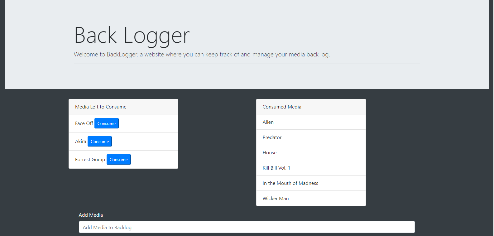

# Back-Logger
Back-Logger is a full-stack web application which uses Object Relational Mapping to manage sql functions and Express.js to display a front-end application to users. This website stores and allows users to manage a virtual back-log of media they plan to consume, or have already consumed. A SQL database hosted on the server stores all items to display on the list, and dynamically responds to a user's requests to create or update information within the database.

# Link to Deployed Site
[Back Logger](https://back-logger.herokuapp.com/)

# Images


# Technology Used
- HTML
- CSS (Bootstrap)
- JavaScript
- Node.js
- Express.js
- Express Handlebars
- MySQL
- Object Relational Mapping
- RESTful architecture
- Heroku

# Code Snippets
The Snippets below are all the various stages within the process of making a single update to an existing item in the Database. Everything Below is executed once the api PUT call has been made by a user clicking the button to mark an item as completed

```
    router.put("/api/media/:id", function(req, res) {
        condition = "id = " + req.params.id;
        media.updateOne({completed: 1}, condition, function(result) {
            res.json(result)
        });
    });
```
- Above is the first snippet of code run after the request to update has been called in our public JavaScript file. It is stored on the `media_controller.js` file, which handles the Routing for api calls related to the relevent sql model. It calls a function stored within the Media model, and passes it arguments based off of the user's request.

```
    updateOne: function(newVal, condition, cb) {
        orm.updateOne("media", newVal, condition, function(res) {
            cb(res);
        });
    };
```
- Within the `media.js` file, which stores the Media model, the user's request from the previous file is translated into a more specific request to the ORM. Functions in this file all notify the functions within the next file to interact with the "media" table in the database.

```
    updateOne: function(table, newVal, condition, cb) {
        var queryString = "UPDATE "+ table +" SET ? WHERE "+condition;

        connection.query(queryString, [newVal], function(err, result) {
            if (err) throw err;
            cb(result);
        });
    };
```
- Here in our `orm.js` file, we have defined several general functions for interacting with the SQL Database. These functions could be used with any number of data models, however when they are called by the Media model they are set so as to always update the correct table, as demonstrated with the code laid out above. above.

# Learning Points
- Using the Express HandleBars framework in conjunction with jQuery streamline the creation of dynamic and modular front-end web pages.
- Serving up information from a sql database on the back-end to a front-end user interface.
- Providing users the ability to alter the contents of a database and immediately responding to and serving up the user-issued changes.
- Mapping the application according to the professional-standard ORM (Object Relational Mapping) method in order to promote a clearer ane more easily expanded upon code-base. 
- Deploying a database to an online server using Heroku in conjunction with non-native tools.

# Author 
Azfar Haq - [GitHub](https://github.com/aehaq)

# License
Standard MIT License